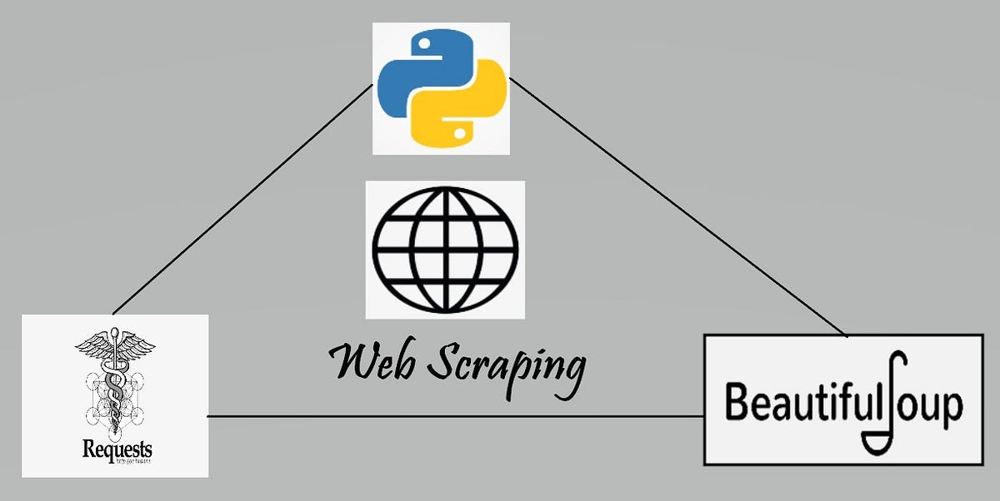

# Scraping leaders wikipedia page

## Table of contents
1. [Introduction](#introduction) 📌
2. [Installation](#installation) 🔧  
3. [Process](#process) 🚀
4. [Completion](#completion) 🏁

## 📌 Introduction

This project is a part of the AI Bootcamp in Gent at BeCode.org involves extracting information from the first paragraph of Wikipedia entries about the leaders of five different countries with the help of requests and beautifulsoup.

## 🔧 Installation

* clone the repository
* install the requirements
* run `main.py` from `src`

## 🚀 Process
* retrived countries list
* scraped leaders list from each and every country including respective url with user cookie
* from url scrape the data of first paragraph in wikipedia with requests and beautifulsoup
* cleaned the output with regex
* created session instead of using cookie everytime
* saved the output in .json file

## 🏁 Completion
- Name                -   Mythili Palanisamy [LinkedIn](https://www.linkedin.com/in/mythili-palanisamy-492147159) [GitHub](https://github.com/MythiliPalanisamy)
- Duration            -   3 days
- Team challenge      -   solo
